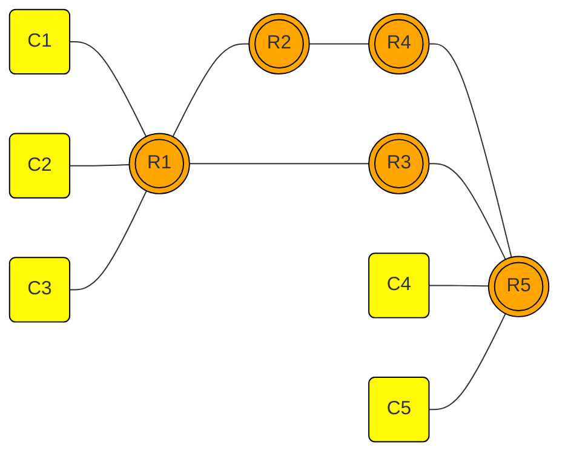

# SRv6 Docker-based Lab
It is just a simple docker-based SRv6 Lab

## Prerequisites
To run this docker SRv6 lab you must use docker engine version <= 26.1.4
If you are on Ubuntu 22.04 LTS, please follow the instruction at the https://docs.docker.com/engine/install/ubuntu/ and select the desired version
```py
VERSION_STRING=5:26.1.4-1~ubuntu.22.04~jammy
sudo apt-get install docker-ce=$VERSION_STRING docker-ce-cli=$VERSION_STRING containerd.io docker-buildx-plugin docker-compose-plugin
```


## The Topology 


## Start the Lab
Run the `./lab_start.sh`
Then run `sh srv6_encaps_ipv4.sh`

## Access the Lab
Example command to access the R1: `docker exec -it R1 bash`

# if you want to steer IPv6 route, you may try below commands
```py
docker exec -it R1 ip -6 route add fc00:10:10:5::/64 encap seg6 mode encap segs fc00:10:10:10::20,fc00:10:10:30::40,fc00:10:10:50::50 dev eth1
docker exec -it R5 ip -6 route add fc00:10:10:1::/64 encap seg6 mode encap segs fc00:10:10:50::40,fc00:10:10:30::20,fc00:10:10:10::10 dev eth2
```

# if you want to steer IPv4 route, you may try below commands
```py
docker exec -it R1 ip -4 route add 10.10.5.0/24 encap seg6 mode encap segs fc00:10:10:5:: dev eth0
docker exec -it R5 ip -4 route add 10.10.1.0/24 encap seg6 mode encap segs fc00:10:10:1:: dev eth0
```

# if you would like to capture the traffic on a some segment you may refer to the below command, just change the example R1R2 example.
of course, you need to install tshark on your Linux.
```py
sudo tshark -i dm-$(docker network ls | grep -i R1R2 | cut -d ' ' -f1) -Y icmpv6 -V |grep -i source
```

## Stop the Lab
Run the `./lab_stop.sh`

You can refer to example commands in the srv6_encaps_ipv4.sh
